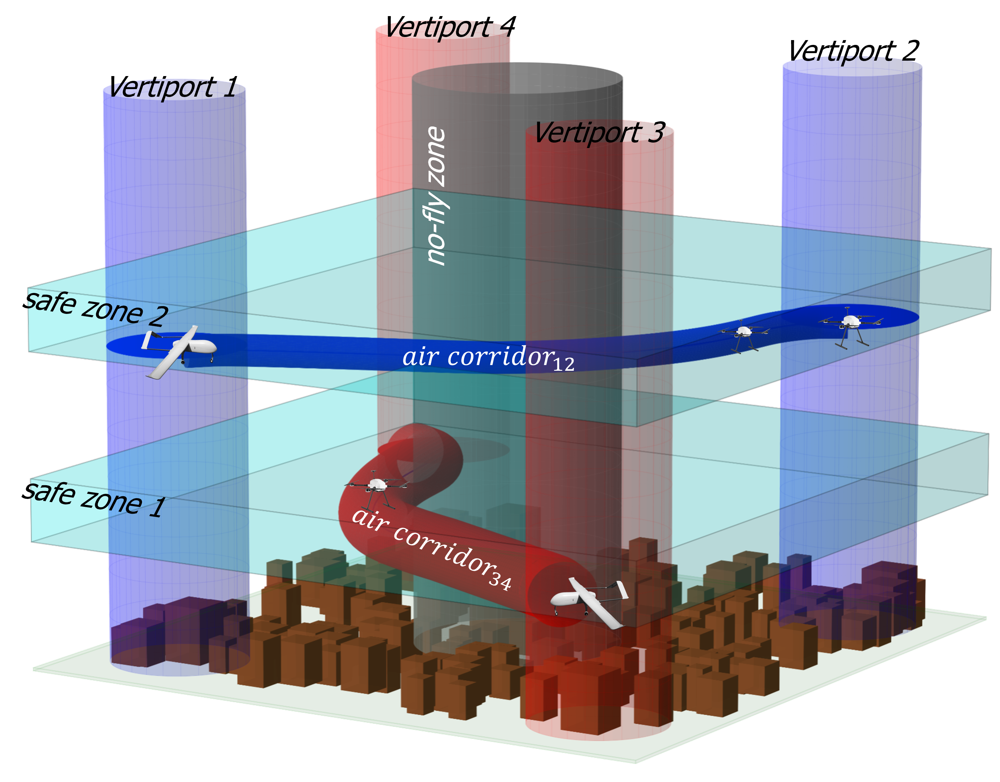
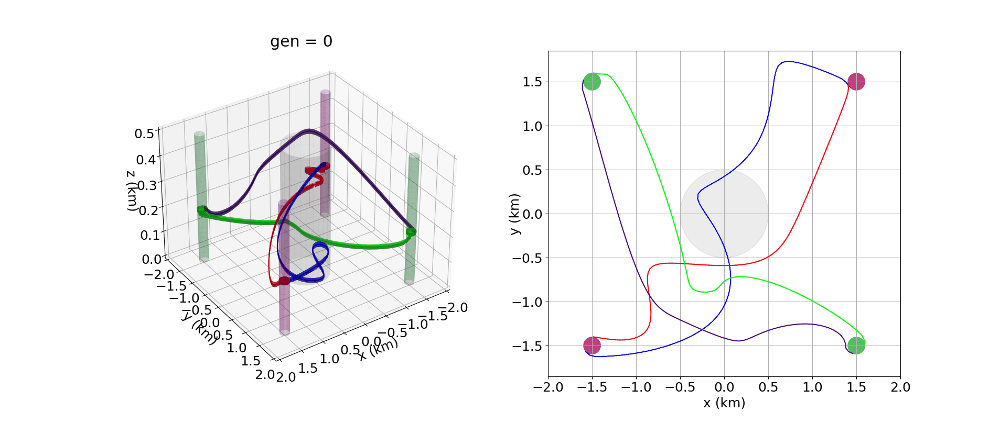
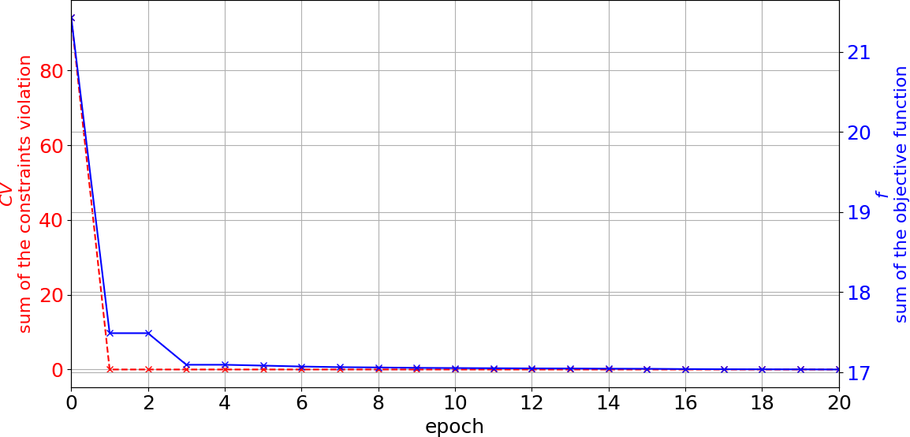
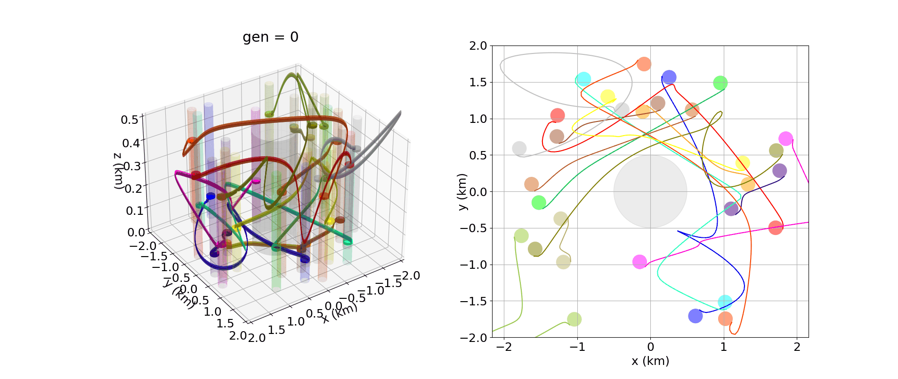
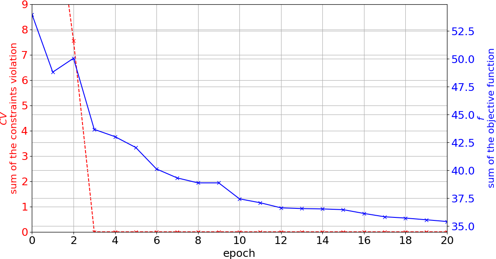
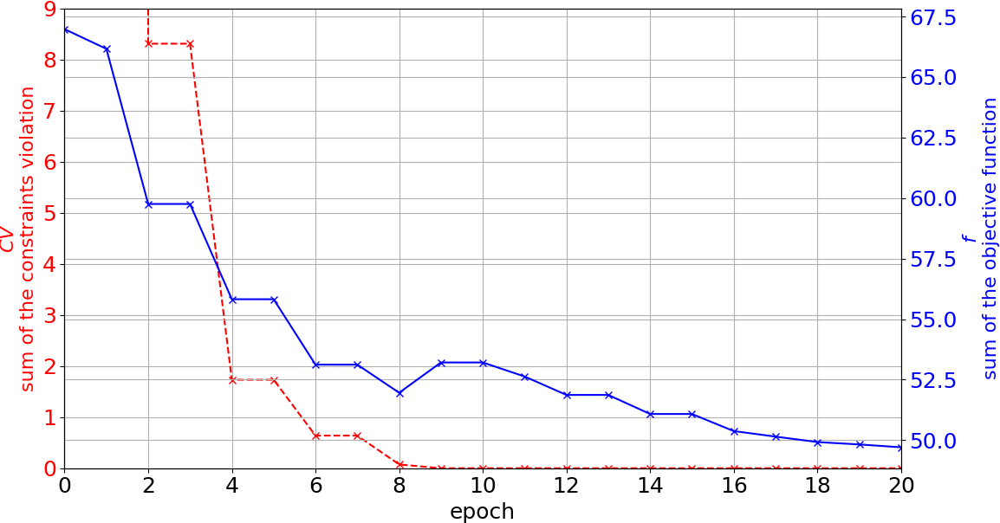

# Air corridor planning for UAVs using a Cooperative Co-Evolutionary approach and NURBS representation

## Abstract

This paper addresses the problem of planning feasible air corridors for UAVs. We propose a novel path planner based on a co-evolutionary approach that considers minimum curvature, no-fly zones, interactions with other air corridors, and adherence to specified altitude-safe zones, with each central path represented by a Non-Uniform Rational B-Spline (NURBS) curve. In addition, our approach accommodates UAVs, such as fixed-wing aircraft, which cannot hover or remain stationary in the air, by providing paths that guide the robots to tangent landing or take-off regions (vertiports). The results of different scenarios with different numbers of vertiports and no-fly zones demonstrate the planner's ability to generate a set of feasible air corridors.

## Simulations

### Scenario 1
- Evolution of the set of air corridors considering 4 vertiports in opposite direction:

## Scenario 2

- Evolution of the set of air corridors considering 15 vertiport pairs

## Scenario 3

- Evolution of the set of air corridors considering a cluttered environment (20 vertiport pairs)

## Folder structure

📂 [Videos](https://github.com/eliasjof/ICUAS_2025_aircorridors/tree/main/videos)

📂 [High-Resolution Figures](https://github.com/eliasjof/ICUAS_2025_aircorridors/tree/main/figures)

## Cite us